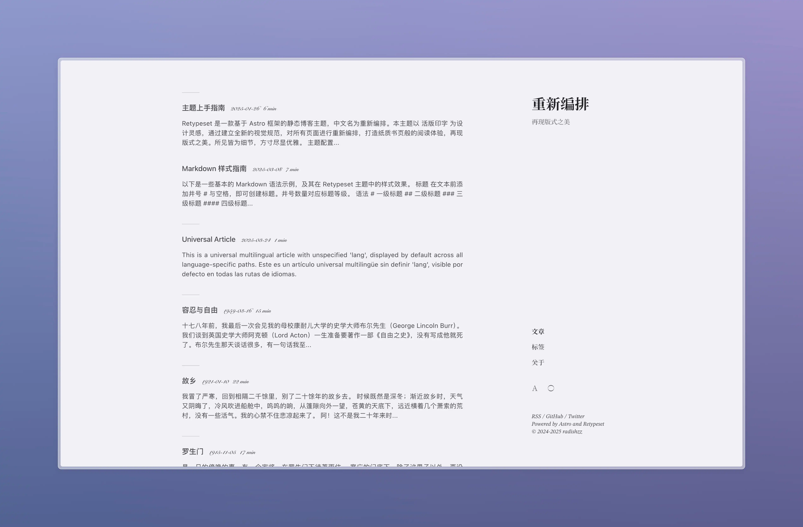
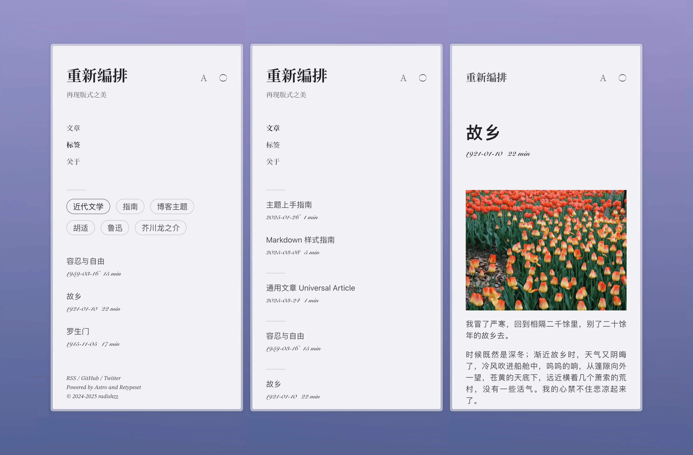

<div align="center">
  <a title="en" href="https://github.com/radishzzz/astro-theme-retypeset?tab=readme-ov-file#retypeset">
    
  </a>
  <picture>
    <source media="(prefers-color-scheme: dark)"
            srcset="https://img.shields.io/badge/-%E7%AE%80%E4%BD%93%E4%B8%AD%E6%96%87-4593F8?style=for-the-badge" />
    <source media="(prefers-color-scheme: light)"
            srcset="https://img.shields.io/badge/-%E7%AE%80%E4%BD%93%E4%B8%AD%E6%96%87-0A69DA?style=for-the-badge" />
    
  </picture>
</div>

# 重新编排

## OrbStack 本地容器部署

OrbStack 已运行时，在项目根目录执行：

```bash
pnpm local
docker compose ps
```

- 博客：**http://127.0.0.1:8080/**（相册入口 `/gallery/`）。
- 管理台：**http://127.0.0.1:8080/admin/**。
- 私有预览：点击管理台的预览按钮后自动启动，端口为 **4322**；直接访问需要先通过管理台授权。

博客和管理台运行在同一个 `stardust` 容器中。Nginx 提供静态博客，并把 `/admin/` 转发到容器内的管理进程；宿主机只开放站点端口和按需启动的私有预览端口。博客页脚中的「管理」只会出现在这个本地构建中，GitHub Pages 不会生成该入口。

日常流程：在管理台编辑并保存文章/相册，检查私有预览，然后进入「发布中心」点击 **发布到本地**。系统先执行完整构建，成功后原子切换博客版本；失败时继续提供上一次成功版本。保存文件不会立即改变公开博客。构建期间暂时禁止编辑，避免发布一半修改。

文章与相册元数据持久化到本项目 `src/content`，图片通过宿主机 PicGo 上传到腾讯云 COS，仅保存 HTTPS 链接，备份与本地发布版本保存在 `.local/`。Linux 依赖、Astro 缓存和构建输出使用 Docker 命名卷，与 macOS 的 `node_modules` 分开。重启容器会保留内容与当前站点；重建镜像会加载镜像中通过检查的新版本。修改功能代码或依赖后，再执行 `docker compose up -d --build`。

常用运维：

```bash
docker compose logs --tail=100 stardust
docker compose restart
docker compose down
```

`docker compose down` 停止服务，保留本地文件和命名卷。`pnpm local` 会通过现有的 Git 凭据链读取 GitHub 登录信息并传入容器，不会把 Token 写入项目文件。可用 `docker compose exec stardust gh auth status` 检查容器内的登录状态。

当前主题保留 Retypeset 的排版风格，并清理模板作者的评论/统计/验证配置；改进手机导航、键盘焦点、图片放大与 Esc 关闭、页面标题层级及语言/订阅链接。评论默认为关闭，配置自己的服务后再启用。

## 本地内容管理与相册

在项目根目录运行 `pnpm admin`，然后访问 **http://127.0.0.1:4310**。管理台只监听本机，关闭终端进程会同时停止管理台与私有预览。可用 `STARDUST_ADMIN_PORT` 和 `STARDUST_PREVIEW_PORT` 指定不同端口（默认分别为 4310、4322）。

- **文章**：搜索、按状态筛选、新建和编辑 Markdown/MDX，修改日期、标签、摘要、目录、置顶和短链接；支持批量公开、转草稿或隐藏。新文章默认是草稿。已有正文、未知 Front Matter 字段及注释会保留。
- **相册**：新建相册后填写标题，即可选择照片；系统自动保存相册，再通过 PicGo 批量上传到腾讯云 COS；支持拖拽/按钮排序、封面、说明、替代文本、拍摄日期和单张隐藏。相册默认是草稿。公开地址为 `/gallery/`，英文入口为 `/en/gallery/`。留空语言的相册在两种语言中显示。
- **私有预览**：点击「预览」或「保存并预览」，管理台会启动受会话保护的本机 Astro 预览。草稿与隐藏内容可在此检查；统计脚本、评论和索引被关闭。
- **发布中心**：可分别发布本地博客，或审阅全部待发布内容后运行完整构建、提交文章与相册元数据、推送 `main` 并跟踪 GitHub Pages 工作流。推送失败会保留提交，可重试推送。
- **本地备份**：覆盖内容前自动备份，可查看并恢复。备份、操作记录、缓存及管理会话均存于被 Git 忽略的 `.local/`。
- **媒体库**：汇总文章与相册中的 HTTPS 图片链接，按链接去重，可搜索、筛选 Live 并查看使用位置。在文章或相册编辑器中选择已有照片，连同摄影参数和 Live 链接一起复用，无需重新上传；插入后仍需保存。

首次使用发布中心前，需要按项目通常的 Git 流程提交并推送本次功能代码。管理台会阻止夹带未提交的功能代码、其他暂存文件或已有未推送提交；远端变化、构建失败或构建期间内容变化均会停止发布。保存/调整状态只修改本地文件，点击发布并部署成功后才会影响线上。

相册信息位于 `src/content/albums/<相册标识>.json`，照片的 `src` 是 HTTPS 图片链接，同时记录尺寸、说明、排序及摄影参数。上传时校正方向、压缩至最大 2400px WebP、去除 EXIF，单张输入上限 15 MB；OrbStack 容器包含 HEIC 解码器；直接运行时需要系统提供 `heif-convert`。图片不存入 Git，不生成本地缩略图或静态相册图片；浏览器直接加载 COS 链接。现成的 COS/CDN 链接也可直接添加，文章编辑器上传照片后插入 `::photo` 指令，保存链接、摄影参数和可选的 Live 视频链接，正文需要另行保存。已有普通 Markdown 图片仍可放大查看。

保持宿主机 **PicGo** 开启，将默认图床设为 **腾讯云 COS**，服务端口为 **36677**。管理台「检查 PicGo 服务」可验证连接。Compose 通过 `host.docker.internal:36677` 访问服务；兼容当前 PicGo 2.3.1 的文件路径接口，在 `.local/picgo-uploads` 写入临时 WebP，上传完成或失败后即删除。COS 密钥继续由 PicGo 管理，不写入博客或容器。此流程基于 [PicGo 官方 HTTP 接口](https://docs.picgo.app/zh/gui/guide/advance)。

在项目根目录执行 Compose 命令，以便 `${PWD}` 正确映射宿主机目录；从其他目录调用时先设置 `STARDUST_PICGO_HOST_ROOT` 为本项目的绝对路径。直接运行 `pnpm admin` 时默认访问 `http://127.0.0.1:36677`，也可用 `STARDUST_PICGO_URL` 修改本机服务地址。

隐藏照片会从博客构建中排除其链接；COS 上的对象仍保留，需要彻底删除时请在 COS 管理。隐藏封面自动换成首张可见照片，没有可见照片的相册不会公开。相册首页汇总所有公开照片，单相册和首页均使用独立满屏布局，斜向图片长列贯穿视口。尺寸、缩放、倾斜和连续滚动参考 [Stack Gallery](https://stack-gallery.vercel.app/steps/3-scroll/)，支持滚轮、方向键、触摸滑动、点击展开、Esc 收起及网格切换，减少动画偏好默认使用网格。图片保留完整画幅。

摄影查看器参考 [Linen](https://github.com/LynanBreeze/hexo-theme-linen) 的照片参数与 Live 交互，用 PhotoSwipe 实现放大、拖动、触摸缩放和连续浏览。在压缩去 EXIF 前提取相机、镜头、焦距、光圈、快门、ISO、曝光补偿、拍摄日期；没有参数的图片不会虚构参数。管理台每张照片的「摄影参数」可手动修改，地点只允许手动填写，不提取 GPS。

**Live 导入**：同时选择同名静态照片和 MOV/MP4（例如 `IMG_1234.HEIC` + `IMG_1234.MOV`），自动关联；也可在照片下单独制作 Live 或粘贴 HTTPS 视频链接。批量配对的视频最大 40 MB、30 秒；单张「制作 / 替换 Live」支持最长 5 分钟的源视频，先本地预览、填写起止时间，再导出最长 30 秒的片段。容器用 FFmpeg 转为最长边 1920px 的 H264 / AAC MP4，经 PicGo 上传 COS。正文与大图查看器均支持点击 LIVE 或长按照片播放，默认静音；大图还可切换声音、循环播放。视频仅在主动播放时请求，离开照片、切换页面或关闭查看器会停止播放。视频和图片只保留云端链接，解码/转码临时文件在成功或失败后清除。直接运行管理台时需安装 FFmpeg。Apple 的 `.livp` 压缩包需要先导出为照片与视频两个文件。默认输出 SDR WebP，暂未提供 HDR 原片切换。

文章也能使用同一查看器，手工写法示例：

```markdown
::photo{src="https://你的COS域名/photo.webp" title="山间" width="1600" height="1200" camera="Sony ILCE-7M4" lens="FE 35mm F1.8" focalLength="35 mm" aperture="ƒ/2.8" shutter="1/250 s" iso="ISO 100" taken="2026-10-02" live="https://你的COS域名/live.mp4"}
```

`live` 与摄影参数都可省略。图片和视频链接必须是 HTTPS，参数作为文本安全渲染，不插入 HTML。

连续的 Markdown 图片会自动混排。摄影指令可用以下容器分组，`columns` 可选 2、3、4，默认每行最多 4 张；管理台也提供「将选中照片排为一组」。横竖图按画幅分配宽度，手机每行最多两张。

```markdown
:::photos{columns="2"}

::photo{src="https://你的COS域名/photo-1.webp" title="山间" width="1600" height="1200"}

::photo{src="https://你的COS域名/photo-2.webp" title="街角" width="1200" height="1600"}

:::
```

照片平时只显示简短标题；大图采用白色背景，摄影参数常驻底部，补充说明可单独展开。查看器仅预加载前一张、后两张，省流/低速网络进一步减少预加载；RSS 输出静态照片与 Live 链接。宽屏文章左侧为目录，右侧为按年份整理的同标签文章；窄屏使用浮动目录和文末标签列表。长代码可展开/收起，阅读时间分别估算文字、代码与图片。

单个相册支持最多 5000 张照片。堆叠视图最多挂载 33 张卡片，网格按可见行及缓冲行渲染，滚动逐帧只平移整条轨道，跨越照片或改变布局时才更新卡片。预览在浏览器内绘制为最长边不超过 1024px 的缩小图，大图查看器仍读取原 COS 链接；不生成本地图片文件。附近卡片复用，离屏缓存最多 48 张且像素缓存不超过 800 万像素，图片同时加载/解码最多 3 张。大图数据直接来自元数据数组，不创建全部照片的隐藏链接。管理台照片编辑器每页 12 张，翻页保留已修改内容。照片链接和元数据仍完整保存在 JSON 中。

本地保留「千张照片 · 性能体验」草稿相册（`qa-thousand-photos`）：管理台进入相册后点击「预览」，或打开 [千张照片本地预览](http://127.0.0.1:8080/admin/?preview-album=qa-thousand-photos) 即可体验；入口会申请当前的私有预览地址，容器重启后仍可使用；使用 5 张开放许可演示照片循环组成 1000 条记录。它用于检查节点数量、跳转和切换，不代表 1000 个不同图片文件的冷加载测试，也不会进入公开博客。

文章的 `draft: true` 和 `hidden: true` 都会从公开详情页、列表、标签、RSS/Atom、OG 图片和站点地图中排除。隐藏表示网站下架，源文件与已有 Git 历史仍保留。原有未设置状态的文章继续公开。

原内容目录中 23 份没有被文章引用的图片已移至 `.local/unused-post-images/src/content/posts/`，可按 `manifest.json` 中的原路径恢复；这份本地备份不会进入 Git 或 Docker 镜像。

验证命令：`pnpm test:admin`、`pnpm astro check`、`pnpm build`。


Retypeset 是一款基于 [Astro](https://astro.build/) 框架的静态博客主题，中文名为重新编排。本主题以 [活版印字](https://astro-theme-typography.vercel.app/) 为设计灵感，通过建立全新的视觉规范，对所有页面进行重新编排，打造纸质书页般的阅读体验，再现版式之美。所见皆为细节，方寸尽显优雅。

## 预览

- [重新编排](https://retypeset.radishzz.cc/)
- [重新編排](https://retypeset.radishzz.cc/zh-tw/)
- [再組版](https://retypeset.radishzz.cc/ja/)
- [Retypeset](https://retypeset.radishzz.cc/en/)
- [Retipografía](https://retypeset.radishzz.cc/es/)
- [Переверстка](https://retypeset.radishzz.cc/ru/)

## 特征

- 基于 Astro 与 UnoCSS 开发
- 支持 SEO、Sitemap、OpenGraph、TOC、RSS、MDX 和 LaTeX
- i18n 多语言
- 亮色/暗色模式
- 优雅的过渡动画
- 丰富的主题配置
- 中文排版优化
- 响应式设计
- 评论系统

## 性能

<br>
<p align="center">
  <a href="https://pagespeed.web.dev/analysis?url=https%3A%2F%2Fretypeset.radishzz.cc%2F&form_factor=desktop">
    
  <a>
</p>

## 开始

1. [Fork](https://github.com/radishzzz/astro-theme-retypeset/fork) 此仓库，或使用此模版创建新仓库。
2. 在终端执行以下指令：

   ```bash
   # 克隆仓库
   git clone <仓库地址>

   # 进入项目目录
   cd <仓库名称>

   # 全局安装 pnpm（如果未安装）
   npm install -g pnpm

   # 安装依赖
   pnpm install

   # 启动开发服务器
   pnpm dev
   ```

3. 参考 [主题上手指南](https://retypeset.radishzz.cc/posts/theme-guide/)，自定义你的博客并创建新文章。
4. 参考 [Astro 部署指南](https://docs.astro.build/zh-cn/guides/deploy/)，将博客部署至 Netlify、Vercel 等平台。

&emsp;[](https://app.netlify.com/start) [](https://vercel.com/new)

## 更新

Retypeset 会不定期发布 [新功能](https://github.com/radishzzz/astro-theme-retypeset/issues/18)，执行 `pnpm update-theme` 即可更新主题。如果遇到合并冲突，请参考 [此视频](https://youtu.be/lz5OuKzvadQ?si=sH_ALNgqxrYqNVQT) 手动解决。

## 鸣谢

- [Typography](https://github.com/moeyua/astro-theme-typography)
- [Fuwriu](https://github.com/saicaca/fuwari)
- [Redefine](https://github.com/EvanNotFound/hexo-theme-redefine)
- [AstroPaper](https://github.com/satnaing/astro-paper)
- [赫蹏](https://github.com/sivan/heti)
- [初夏明朝體](https://github.com/GuiWonder/EarlySummerSerif)

## Star History

<p align="center">
<a href="https://star-history.com/#radishzzz/astro-theme-retypeset&Date">
  <picture>
    <source media="(prefers-color-scheme: dark)" srcset="https://api.star-history.com/svg?repos=radishzzz/astro-theme-retypeset&type=Date&theme=dark" />
    <source media="(prefers-color-scheme: light)" srcset="https://api.star-history.com/svg?repos=radishzzz/astro-theme-retypeset&type=Date" />
    
  </picture>
</p>
